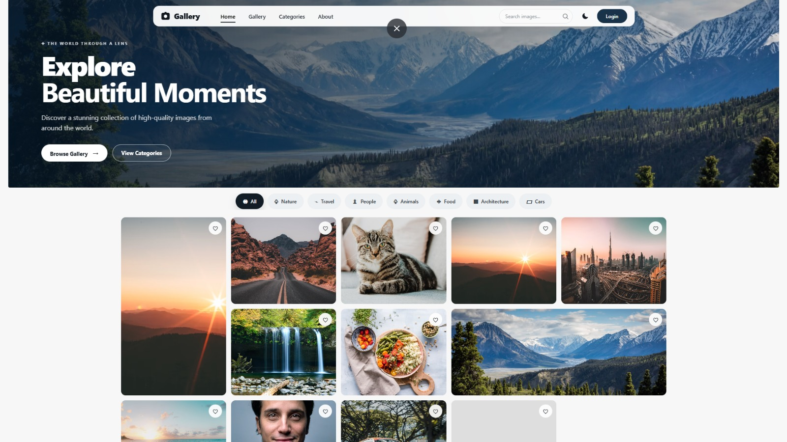
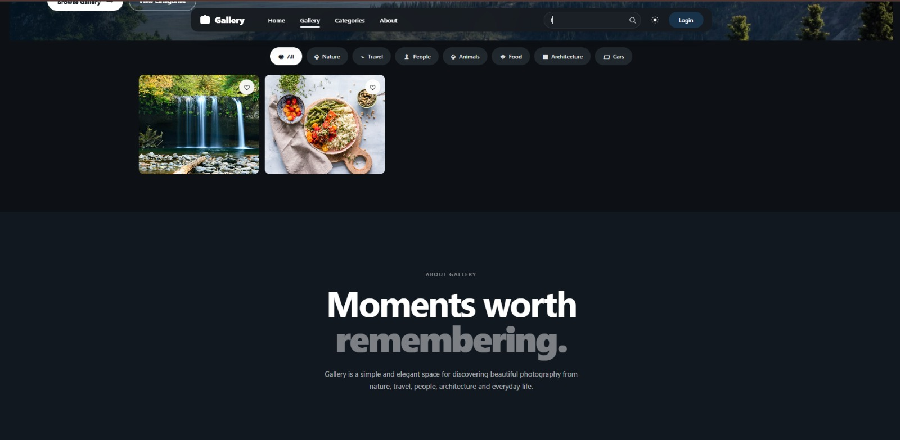
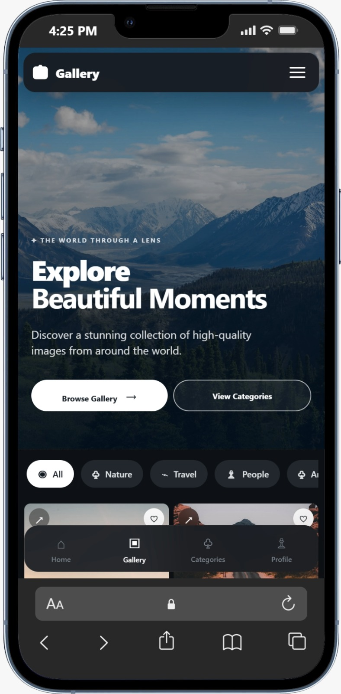
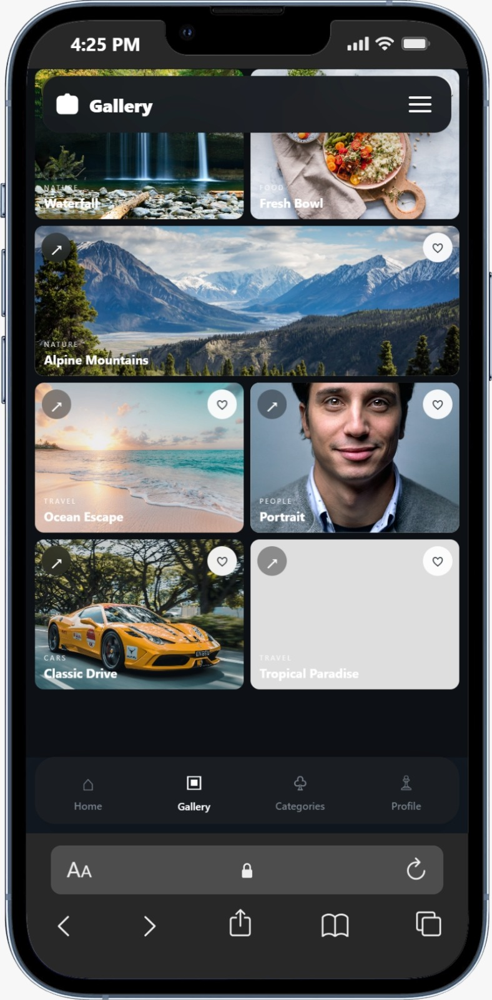

# 🖼️ Image3 Gallery

<p align="center">
  
</p>

<p align="center">
  <strong>✨ Modern • Responsive • Visual Gallery</strong>
</p>

<p align="center">
  A clean and modern image gallery built with a focus on simplicity,
  responsive design and a smooth visual experience.
</p>

---

## 📸 Gallery Preview

<p align="center">
  
  
</p>

<p align="center">
  
  
</p>

<p align="center">
  
</p>

---

## ✨ Features

- 🖼️ Clean image gallery
- 📱 Responsive layout
- 💻 Desktop & mobile friendly
- 🎨 Modern visual interface
- ⚡ Lightweight frontend
- 🧩 Simple and easy to customize

---

## 🛠️ Built With

- HTML5
- CSS3
- JavaScript

---

## 🚀 Getting Started

Clone the repository:

```bash
git clone https://github.com/YOUR-USERNAME/gallery-project.git
